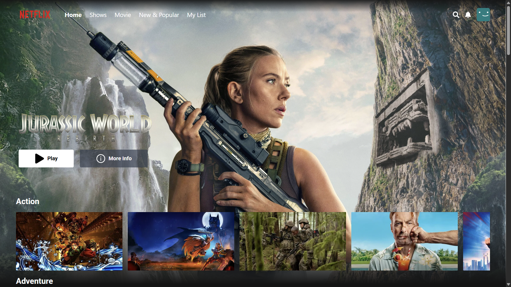
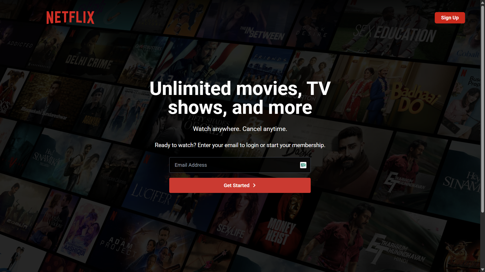

# 🎬 React Netflix Clone

### Home Page



### Login Page



A Netflix-inspired web application built with **React**, **Firebase**, and **TMDB API**.  
This project replicates core features of Netflix such as movie browsing, trailers, authentication, and personalized lists.

---

## 🚀 Features

- 🔐 **Authentication** – Login & Signup with Firebase Auth
- 🎞 **Browse Movies & TV Shows** – Data fetched from TMDB API
- 📺 **Trailer Playback** – Integrated with YouTube player
- ❤️ **My List** – Save your favorite movies/shows
- 🌐 **Responsive UI** – Works on desktop only
- 🎨 **Smooth Animations** – Powered by Framer Motion

---

## 🛠️ Tech Stack

- **React 19** – UI library
- **React Router 7** – Navigation & routing
- **Firebase 12** – Authentication & hosting
- **Axios** – API calls
- **Framer Motion** – Animations
- **React Icons** – Icons
- **TMDB API** – Movie & TV data
- **React YouTube** – Trailer embedding

---

## 🚀 Deployment

You can access the live deployed app here:
https://react-netflix-clone-puce.vercel.app/

---

## ⚙️ Setup & Installation

Clone the repository

- git clone https://github.com/sreelal46/react-netflix-clone.git
- cd react-netflix-clone

Install dependencies

**npm install**

Create .env file in the root directory:

VITE_TMDB_API_KEY=your_tmdb_api_key

Run the app locally

npm run dev

---

## 🙌 Acknowledgements

**TMDB API**
for movie & TV data

**Firebase**
for authentication & hosting

**Inspired by Netflix UI**

---

## 📜 License

This project is for educational purposes only.
Not affiliated with Netflix or TMDB.

---

```

```
